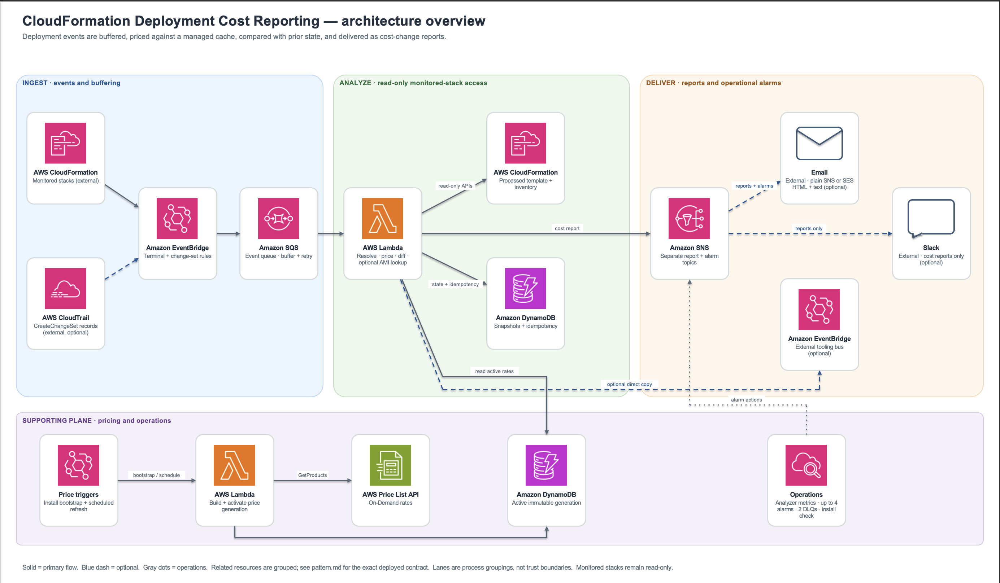

# Sample CloudFormation Deployment Cost Reporting

Repository: [aws-samples/sample-cloudformation-deployment-cost-reporting](https://github.com/aws-samples/sample-cloudformation-deployment-cost-reporting)

> [!WARNING]
> This repository is sample and educational code. It is not production-ready without independent security review, environment-specific hardening, and end-to-end testing. Read [SECURITY.md](SECURITY.md) before deployment.

This sample is a Regional, event-driven observer that estimates the effective monthly cost change introduced by supported AWS CloudFormation deployments. It reads monitored stacks through read-only CloudFormation APIs, compares each confirmed deployment with the last confirmed snapshot, and reports added, removed, resized, replaced, and retained resources without requiring changes to application templates or deployment pipelines.

Reports use public USD On-Demand rates and explicitly identify unsupported, usage-based, unresolved, and price-unavailable resources. They are estimates, not invoices. Use AWS Cost Explorer or Cost and Usage Reports for actual spend.

## Contents

- [Key behavior](#key-behavior)
- [Architecture](#architecture)
- [Report model](#report-model)
- [Pricing scope](#pricing-scope)
- [Prerequisites](#prerequisites)
- [Local validation and build](#local-validation-and-build)
- [Safe first deployment](#safe-first-deployment)
- [Configuration reference](#configuration-reference)
- [Outputs](#outputs)
- [Optional integrations](#optional-integrations)
- [Operations](#operations)
- [Troubleshooting](#troubleshooting)
- [Security and limitations](#security-and-limitations)
- [Lifecycle](#lifecycle)
- [Repository layout](#repository-layout)
- [Contributing, security, and license](#contributing-security-and-license)

## Key behavior

- **Confirmed reports:** EventBridge matches `CREATE_COMPLETE`, `UPDATE_COMPLETE`, `DELETE_COMPLETE`, `UPDATE_ROLLBACK_COMPLETE`, and `ROLLBACK_COMPLETE` stack events.
- **Optional estimates:** CloudTrail `CreateChangeSet` events can produce `ESTIMATE` reports before deployment. Estimates never advance confirmed snapshots.
- **No monitored-stack mutation:** Runtime roles have no CloudFormation create, update, execute, or delete actions and no `iam:PassRole`.
- **Baseline before delta:** A genuine first create reports all resources as added. The first observation of an existing stack is a zero-delta baseline instead of a fabricated increase.
- **Publish before commit:** When a report is emitted, confirmed state advances only after every configured publisher accepts it. A below-threshold confirmed outcome emits no report and still advances state.
- **Stable report IDs:** Analyzer-generated `reportId` values are deterministic per operation, so consumers can deduplicate at-least-once delivery.
- **Visible uncertainty:** Free, usage-based, unsupported, unresolved, and price-unavailable resources remain visible in coverage rather than receiving invented prices.
- **Atomic price refresh:** New price generations activate only after every requested Region is healthy. An unhealthy refresh leaves the previous generation active.
- **Independent failure paths:** Analyzer events and optional Slack/SES delivery use separate dead-letter queues (DLQs).
- **Exact self-exclusion:** The solution suppresses events only for its exact deployment stack ARN.

## Architecture



1. **Bootstrap pricing.** An install-time custom resource invokes the price-sync function before either event rule is enabled. EventBridge Scheduler refreshes prices later.
2. **Capture deployments.** EventBridge sends supported terminal stack events and optional CloudTrail `CreateChangeSet` records to one encrypted SQS queue.
3. **Analyze safely.** The analyzer reads the processed template, stack context, and fully paginated physical inventory. With `ROLLUP`, it walks readable nested stacks up to `MaxNestedDepth`.
4. **Price and compare.** The analyzer reads the active DynamoDB price generation and the previous confirmed snapshot, then computes movements, retained cost, coverage, and reconciliation.
5. **Publish.** One canonical schema-1.0 report goes to the local SNS report topic. `CENTRAL_BUS` additionally forwards a copy directly to an external EventBridge bus.
6. **Deliver and observe.** Plain SNS email, optional SES, and optional Slack render reports. CloudWatch alarms use a separate alarm topic.

### Runtime components

- Python 3.13 on arm64 with active AWS X-Ray tracing
- Analyzer: 1024 MB, 300-second timeout, reserved concurrency 10
- Price sync: 1024 MB, 900-second timeout
- Optional Slack, SES, and install-check functions: 256 MB, 60-second timeout
- Three always-on DynamoDB tables: price, stack state, and idempotency
- Optional Slack-correlation table
- One event queue, one analyzer DLQ, and one subscriber-delivery DLQ
- Separate report and alarm SNS topics

## Report model

The canonical JSON report uses `schemaVersion: "1.0"` and includes:

- stack, account, Region, tags, status, phase, and console URL
- pricing basis, currency, and optional discount
- current and previous stack totals
- monthly and annual net change
- non-baseline `added`, `removed`, and `changed` arrays, an optional `retained` array, and an `unchanged` count; baseline reports use a priced `inventory` array instead
- coverage counts and explicit `unpriced` buckets
- optional notes, pricing-basis fields, per-movement exclusions and confidence, and reconciliation status

### Phases and baselines

- `ESTIMATE` reports are based on change sets and are not persisted as stack state.
- `CONFIRMED` reports are based on completed stack operations and can advance the stored snapshot.
- A first non-create observation becomes `BASELINE`, with current inventory and zero net change.
- A deletion without history reports unknown prior cost instead of inventing savings.

### Movement and retention

- A pricing fingerprint change or effective-cost change produces a `changed` item.
- A physical ID change is identified as replacement.
- A retained resource leaves the stack but remains billable, so it appears under `retained` and is not counted as savings.
- A metadata-only deployment produces no cost movement when the pricing fingerprint and effective cost are unchanged; a newly active rate can still produce a `unitPrice` change. At `NotifyThreshold=0`, the deployment can produce a neutral report.

### Coverage

Coverage is calculated over potentially chargeable resources:

```text
priced / (priced + usage-based + unsupported + unresolved)
```

Known-free scaffolding is excluded from the denominator. The `unpriced.unresolved` bucket includes unresolved template inputs and deterministic resources for which no cached rate is available.

Plain SNS email is a human-readable rendering and does not expose every machine field, such as `reportId`. Programmatic subscribers receive the canonical JSON.

### Large reports

Oversized transport copies are trimmed rather than silently dropped. SNS uses a 120,000-byte report budget and central EventBridge delivery uses 240,000 bytes. Detail is removed in this order: `inventory`, `unpriced`, `retained`, `changed`, `removed`, then `added`; identity, totals, and coverage remain. A trimmed payload sets `truncated: true` and adds a note naming omitted sections. Plain SNS email text is separately capped at 30,000 characters. Consumers must tolerate absent detail arrays and use totals and coverage as the preserved summary.

## Pricing scope

Pricing uses public USD On-Demand rates, 730 hours per month, and an optional flat discount. It does not model actual utilization, account-level free-tier allocation, Savings Plans, Reserved Instances, credits, invoices, or account-wide pricing tiers.

### Deterministic resource mappings

| CloudFormation resource | Current coverage | Important exclusions or constraints |
|---|---|---|
| `AWS::EC2::Instance` | Compute hours plus explicit EBS block-device mappings | Current cache path is Shared, On-Demand, no bundled software. Linux is assumed unless AMI lookup is enabled. AMI-provided undeclared storage is excluded. |
| `AWS::EC2::Volume` | Storage, gp3 IOPS above 3000, gp3 throughput above 125 MiB/s, io1 IOPS | Tiered io2 IOPS is excluded. |
| `AWS::RDS::DBInstance` | Non-Aurora compute, mapped storage, and io1/io2 IOPS | Current compute cache path requires no-license engines. Aurora, gp3 IOPS/throughput, and I/O requests are not fully mapped. |
| `AWS::EC2::NatGateway` | Hourly charge | Data processing per GB is excluded. |
| `AWS::ElasticLoadBalancingV2::LoadBalancer` | Application Load Balancer hourly charge | Capacity units are excluded. Network and Gateway Load Balancers classify but currently lack sibling sync rules, so their rates are unavailable. |
| `AWS::ElastiCache::CacheCluster` | Node hours | Backup storage, transfer, Extended Support, Sync Durability, and Outposts variants are excluded. |
| `AWS::ElastiCache::ReplicationGroup` | Shard, primary, and replica node hours | Same exclusions as cache clusters. |
| `AWS::EC2::EIP` | Applies the in-use public IPv4 rate for 730 hours to every EIP | Attachment state is not inspected; idle and contiguous-block rates are not modeled. |
| `AWS::DynamoDB::Table` | Provisioned table and GSI RCU/WCU | On-demand mode is usage-based. Storage and backup/restore are excluded. |

### Usage-based and special classifications

The solution names but does not estimate usage-based resources such as S3 buckets, Lambda functions, CloudFront distributions, API Gateway APIs, SQS queues, SNS topics, CloudWatch Logs log groups, Step Functions state machines, Athena workgroups, SES configuration sets, Kinesis streams, and EFS file systems.

Public ACM certificates and standard SSM parameters are classified as free. Private CA certificates and advanced or intelligent-tiering SSM parameters are unsupported. Unknown types remain unsupported.

## Prerequisites

- Git
- AWS CLI version 2
- AWS SAM CLI
- Python 3.12 or later for local checks
- Python 3.13 on `PATH` for native Lambda builds, or Docker for `sam build --use-container`
- A disposable non-production AWS account and Region for initial validation
- A least-privilege read-only profile for inspection and a separate non-production deployment profile
- Deployment permission for transformed IAM and declared resources, acknowledging `CAPABILITY_IAM`
- Outbound access from the price-sync function to the AWS Price List API and normal AWS service endpoints

The reference path below uses one email address, confirmed reports only, local SNS delivery, metrics, and nested-stack rollup. It intentionally disables estimates, SES, Slack, and central forwarding.

## Local validation and build

The project metadata requires Python 3.12 or later. Development-tool versions are pinned in `pyproject.toml`; the deployed Lambda package separately pins `PyYAML==6.0.3` in `src/requirements.txt`.

```bash
python3 -m venv .venv
source .venv/bin/activate
pip install -e '.[dev]'

pytest
ruff check src tests scripts
mypy
cfn-lint template.yaml
sam validate --lint --template-file template.yaml
```

`mypy` is configured to check `src`. Run `sam validate --lint` in addition to standalone cfn-lint because SAM transform errors are not always visible to cfn-lint.

Build with one of these paths:

```bash
# Native: requires Python 3.13 on PATH.
sam build

# Container alternative: requires a running Docker service.
sam build --use-container
```

## Safe first deployment

Use a disposable non-production account. Verify both profiles before creating a change set:

```bash
export REGION="us-east-1"
export EXPECTED_ACCOUNT_ID="REPLACE_WITH_12_DIGIT_ACCOUNT_ID"
export READ_ONLY_PROFILE="REPLACE_WITH_READ_ONLY_PROFILE"
export DEPLOY_PROFILE="REPLACE_WITH_NON_PRODUCTION_DEPLOY_PROFILE"
export SOLUTION_STACK="cfn-cost-delta-validation"
export NOTIFICATION_EMAIL="REPLACE_WITH_NOTIFICATION_EMAIL"

READ_ACCOUNT=$(aws sts get-caller-identity --query Account --output text --profile "$READ_ONLY_PROFILE")
DEPLOY_ACCOUNT=$(aws sts get-caller-identity --query Account --output text --profile "$DEPLOY_PROFILE")
test "$READ_ACCOUNT" = "$EXPECTED_ACCOUNT_ID" || { echo "Read profile account mismatch"; exit 1; }
test "$DEPLOY_ACCOUNT" = "$EXPECTED_ACCOUNT_ID" || { echo "Deploy profile account mismatch"; exit 1; }
```

Create an unexecuted change set with the narrow reference configuration:

```bash
sam deploy \
  --template-file .aws-sam/build/template.yaml \
  --stack-name "$SOLUTION_STACK" \
  --region "$REGION" \
  --profile "$DEPLOY_PROFILE" \
  --capabilities CAPABILITY_IAM \
  --resolve-s3 \
  --no-execute-changeset \
  --parameter-overrides \
    NotificationEmail="$NOTIFICATION_EMAIL" \
    EnablePreDeployEstimate=false \
    DestinationType=LOCAL_SNS \
    EnableMetrics=true \
    NestedStackHandling=ROLLUP \
    SyncRegions="$REGION"
```

`--resolve-s3` can create or reuse the external `aws-sam-cli-managed-default` artifact bucket/stack and upload artifacts before the solution change set executes.

Set `CHANGE_SET` to the name returned by SAM and inspect it with the read-only profile:

```bash
export CHANGE_SET="REPLACE_WITH_CHANGE_SET_NAME_FROM_SAM_OUTPUT"
aws cloudformation describe-change-set \
  --stack-name "$SOLUTION_STACK" \
  --change-set-name "$CHANGE_SET" \
  --profile "$READ_ONLY_PROFILE" \
  --region "$REGION"
```

Execute only after confirming the account, Region, parameter values, IAM changes, and resources. You can execute the reviewed change set through the CloudFormation console or your approved deployment process. After deployment, inspect outputs:

```bash
aws cloudformation describe-stacks \
  --stack-name "$SOLUTION_STACK" \
  --query 'Stacks[0].Outputs' \
  --output table \
  --profile "$READ_ONLY_PROFILE" \
  --region "$REGION"
```

Expected results:

- `PriceBootstrapStatus` is `HEALTHY`.
- `PreDeployEstimateStatus` is absent because the reference path disables estimates.
- Both email subscriptions—reports and alarms—are confirmed.
- Both DLQs are empty.

## Configuration reference

All 18 parameters are grouped in the CloudFormation console.

| Parameter | Default | Description and constraints |
|---|---:|---|
| `NotificationEmail` | blank | Report and alarm recipient. Blank disables email. Plain SNS is used when the SES sender is blank. |
| `SesSenderEmail` | blank | With a recipient, enables formatted SES HTML and text. Must be blank or email-shaped. |
| `SesIdentityArn` | blank | Optional verified email/domain identity ARN. A nonblank value requires `SesSenderEmail`. |
| `NotifyThreshold` | `0` | Minimum absolute monthly net change to publish; number ≥ 0. Baselines and reconciliation failures always publish. Suppressed confirmed reports still advance state. |
| `DiscountPercent` | `0` | Flat effective discount; number from 0 through 100. |
| `EnablePlatformLookup` | `false` | `true` adds `ec2:DescribeImages`; `false` uses the documented Linux assumption. |
| `PriceSyncSchedule` | `rate(7 days)` | EventBridge Scheduler expression for refreshing immutable price generations. |
| `SyncRegions` | blank | Comma-separated pricing Regions. Blank uses the deployment Region. A nonblank list replaces that fallback. |
| `SlackSecretArn` | blank | Secrets Manager ARN containing a bare token or JSON `token`/`botToken`; must pair with the channel. |
| `SlackChannelId` | blank | Slack channel ID; must pair with the secret ARN. |
| `NestedStackHandling` | `ROLLUP` | `ROLLUP` aggregates readable children and suppresses child events; `SEPARATE` reports each stack. |
| `MaxNestedDepth` | `5` | Number from 1 through 10. Runtime honors whole-number text; a decimal accepted by CloudFormation is rejected by runtime parsing and falls back to 5. Direct children at the effective boundary become explicit coverage gaps. |
| `SnapshotRetentionDays` | `90` | Number ≥ 1. Runtime honors whole-number text; a decimal accepted by CloudFormation is rejected by runtime parsing and falls back to 90. DynamoDB TTL deletion is asynchronous. |
| `EnablePreDeployEstimate` | `true` | `true` creates the CloudTrail-backed estimate path and install check. |
| `DestinationType` | `LOCAL_SNS` | `CENTRAL_BUS` additionally forwards directly to the configured bus; local SNS remains enabled. |
| `CentralBusArn` | blank | Required by a template rule when `DestinationType=CENTRAL_BUS`. |
| `LogLevel` | `INFO` | `DEBUG`, `INFO`, `WARNING`, or `ERROR`. DEBUG can increase sensitive log volume. |
| `EnableMetrics` | `true` | Controls custom metrics and analysis/reconciliation alarms. DLQ alarms always exist. |

Template validation rules require a central bus ARN in central mode, paired Slack settings, and a sender when an explicit SES identity ARN is supplied.

### What defaults deploy

Without overrides, the stack creates no email or Slack subscriptions, uses local SNS, applies no discount or threshold, assumes Linux for EC2, synchronizes the deployment Region every seven days, rolls up nested stacks to depth 5, retains deleted snapshots for 90 days, enables change-set estimates and metrics, and logs at INFO. Because no email is configured, the default alarms have no human subscriber.

## Outputs

| Output | Meaning |
|---|---|
| `ReportTopicArn` | Canonical report topic |
| `AlarmTopicArn` | Separate native operational-alarm topic |
| `DeadLetterQueueUrl` | Analyzer event DLQ |
| `DeliveryDeadLetterQueueUrl` | Slack/SES asynchronous delivery DLQ |
| `StateTableName` | Confirmed stack snapshots |
| `PriceTableName` | Immutable price generations and active metadata |
| `PriceBootstrapStatus` | Initial price generation; a successful deployment should report `HEALTHY` |
| `PreDeployEstimateStatus` | Conditional install-time CloudTrail coverage/selector result; not proof that the trail is currently logging |
| `MetricsNamespace` | `CFNCostPlugin` |

## Optional integrations

### Plain SNS email

Set `NotificationEmail` and leave `SesSenderEmail` blank. CloudFormation creates two confirmation-required subscriptions: reports and operational alarms.

### Formatted SES email

Set `NotificationEmail` and `SesSenderEmail`. Direct email subscriptions are omitted; one Lambda renders report and alarm messages as HTML plus text.

- Verify the sender identity in the deployment Region.
- In the SES sandbox, verify the recipient.
- For a parent-domain identity, pass `SesIdentityArn`.
- DKIM, SPF, DMARC, sender-domain authority, identity lifecycle, and DNS are external responsibilities.

The IAM policy constrains the verified identity and exact From address. The recipient comes from deployment configuration and is used only by the email function.

### Slack

Provide both `SlackSecretArn` and `SlackChannelId`. The secret can contain the bot token directly or as JSON with a `token` or `botToken` field. The bot needs `chat:write` and channel membership.

A confirmed report edits the remembered estimate message when correlation is available. Retryable failures are retried; categorized permanent API/configuration errors are logged and acknowledged, so the delivery DLQ is not a complete failure ledger.

### Pre-deployment estimates

Set `EnablePreDeployEstimate=true`. A CloudTrail trail must cover the Region and include management write events. `PreDeployEstimateStatus` checks trail visibility and selectors at install time; the trail owner must separately confirm that logging is active.

### Central EventBridge forwarding

Set `DestinationType=CENTRAL_BUS` and provide `CentralBusArn`. The analyzer publishes to local SNS and directly calls `PutEvents` on the central bus. The bus, policy, cross-account permission, consumer, dashboard, and central Slack integration are external.

### EC2 platform lookup

Set `EnablePlatformLookup=true` to add `ec2:DescribeImages` and resolve AMI platform details. Otherwise the report states that Linux was assumed.

## Operations

All commands below are read-only. Use the inspection profile and the solution outputs.

### Verify subscriptions and DLQs

```bash
REPORT_TOPIC=$(aws cloudformation describe-stacks --stack-name "$SOLUTION_STACK" \
  --query "Stacks[0].Outputs[?OutputKey=='ReportTopicArn'].OutputValue | [0]" \
  --output text --profile "$READ_ONLY_PROFILE" --region "$REGION")
ALARM_TOPIC=$(aws cloudformation describe-stacks --stack-name "$SOLUTION_STACK" \
  --query "Stacks[0].Outputs[?OutputKey=='AlarmTopicArn'].OutputValue | [0]" \
  --output text --profile "$READ_ONLY_PROFILE" --region "$REGION")
ANALYZER_DLQ=$(aws cloudformation describe-stacks --stack-name "$SOLUTION_STACK" \
  --query "Stacks[0].Outputs[?OutputKey=='DeadLetterQueueUrl'].OutputValue | [0]" \
  --output text --profile "$READ_ONLY_PROFILE" --region "$REGION")
DELIVERY_DLQ=$(aws cloudformation describe-stacks --stack-name "$SOLUTION_STACK" \
  --query "Stacks[0].Outputs[?OutputKey=='DeliveryDeadLetterQueueUrl'].OutputValue | [0]" \
  --output text --profile "$READ_ONLY_PROFILE" --region "$REGION")

for TOPIC_ARN in "$REPORT_TOPIC" "$ALARM_TOPIC"; do
  aws sns list-subscriptions-by-topic --topic-arn "$TOPIC_ARN" \
    --query 'Subscriptions[].[Protocol,Endpoint,SubscriptionArn]' --output table \
    --profile "$READ_ONLY_PROFILE" --region "$REGION"
done

for QUEUE_URL in "$ANALYZER_DLQ" "$DELIVERY_DLQ"; do
  aws sqs get-queue-attributes --queue-url "$QUEUE_URL" \
    --attribute-names ApproximateNumberOfMessages \
      ApproximateNumberOfMessagesNotVisible ApproximateNumberOfMessagesDelayed \
    --profile "$READ_ONLY_PROFILE" --region "$REGION"
done
```

### Verify pricing freshness and triggers

```bash
PRICE_TABLE=$(aws cloudformation describe-stacks --stack-name "$SOLUTION_STACK" \
  --query "Stacks[0].Outputs[?OutputKey=='PriceTableName'].OutputValue | [0]" \
  --output text --profile "$READ_ONLY_PROFILE" --region "$REGION")

aws dynamodb get-item --table-name "$PRICE_TABLE" \
  --key '{"pk":{"S":"__meta__"}}' --consistent-read \
  --profile "$READ_ONLY_PROFILE" --region "$REGION"

aws cloudformation list-stack-resources --stack-name "$SOLUTION_STACK" \
  --query "StackResourceSummaries[?ResourceType=='AWS::Events::Rule' || ResourceType=='AWS::Scheduler::Schedule'].[ResourceType,PhysicalResourceId,ResourceStatus]" \
  --output table --profile "$READ_ONLY_PROFILE" --region "$REGION"
```

The metadata item includes `activeGeneration`, `priceListVersion`, `syncedAt`, and `priceCount`. With the default weekly schedule, investigate when `syncedAt` is older than eight days.

### Review alarms and logs

```bash
ALARM_NAMES=$(aws cloudformation list-stack-resources --stack-name "$SOLUTION_STACK" \
  --query "StackResourceSummaries[?ResourceType=='AWS::CloudWatch::Alarm'].PhysicalResourceId" \
  --output text --profile "$READ_ONLY_PROFILE" --region "$REGION")
aws cloudwatch describe-alarms --alarm-names $ALARM_NAMES \
  --query 'MetricAlarms[].[AlarmName,StateValue,StateReason]' --output table \
  --profile "$READ_ONLY_PROFILE" --region "$REGION"

ANALYZER_FUNCTION=$(aws cloudformation list-stack-resources --stack-name "$SOLUTION_STACK" \
  --query "StackResourceSummaries[?LogicalResourceId=='AnalyzerFunction'].PhysicalResourceId | [0]" \
  --output text --profile "$READ_ONLY_PROFILE" --region "$REGION")
PRICE_SYNC_FUNCTION=$(aws cloudformation list-stack-resources --stack-name "$SOLUTION_STACK" \
  --query "StackResourceSummaries[?LogicalResourceId=='PriceSyncFunction'].PhysicalResourceId | [0]" \
  --output text --profile "$READ_ONLY_PROFILE" --region "$REGION")

aws logs tail "/aws/lambda/$ANALYZER_FUNCTION" --since 1h \
  --profile "$READ_ONLY_PROFILE" --region "$REGION"
aws logs tail "/aws/lambda/$PRICE_SYNC_FUNCTION" --since 1h \
  --profile "$READ_ONLY_PROFILE" --region "$REGION"
```

### Read-only live checks

These scripts call live AWS APIs but do not create or modify resources:

```bash
python scripts/verify_pricing_rules.py --profile "$READ_ONLY_PROFILE" --region "$REGION"
python scripts/scan_account_coverage.py --profile "$READ_ONLY_PROFILE" \
  --region "$REGION" --max-stacks 50
```

The pricing-rule script checks live attribute compatibility, zero-match rules, and rate-key collisions. The account scan measures mapper fit; it does not guarantee that every mapped resource has a cached price.

## Troubleshooting

| Issue | Checks and actions |
|---|---|
| Price bootstrap fails | Inspect CloudFormation events and price-sync logs. Confirm outbound access and `pricing:GetProducts`. Run the pricing-rule check for the deployment Region and review any zero-match rule or collision before redeploying. |
| No confirmed report | Confirm subscriptions and the terminal EventBridge rule, inspect analyzer logs and DLQ counts, and review `NotifyThreshold` and `NestedStackHandling`. A below-threshold report or rolled-up child event can be intentionally suppressed. |
| No estimate | Confirm the parameter and install-check output, then ask the trail owner to verify management-write selectors and current logging state. The install check does not call `GetTrailStatus`. |
| Deterministic resource is unavailable | Review the report's coverage reason and run the pricing-rule check for the same Region. A mapper does not guarantee that a cache-backed rate exists for every configuration. |
| Pricing is stale | Inspect `__meta__.syncedAt`, the Scheduler resource, and price-sync logs. No built-in freshness alarm exists. |
| Duplicate report | Deduplicate on `reportId`. A retry after partial delivery, commit failure, or temporary idempotency failure can replay an accepted destination. |
| Slack/SES failure with empty delivery DLQ | Inspect subscriber logs. Categorized permanent configuration, identity, and message errors are logged and acknowledged rather than retried to the DLQ. |
| Custom metric is missing | Check `EnableMetrics` and analyzer logs. Metric publication is best effort and does not replay an accepted report. |
| Estimate differs from the bill | Review the pricing basis, notes, discount, retained resources, coverage, and unpriced sections. Use Cost Explorer or Cost and Usage Reports for actual spend. |

## Security and limitations

- This is a reference implementation, not a production-ready service.
- Runtime functions cannot mutate monitored stacks or customer resources.
- DynamoDB and SQS use AWS-managed encryption. `ReportTopic` uses `alias/aws/sns`.
- `AlarmTopic` is unencrypted because CloudWatch alarms cannot use the immutable `alias/aws/sns` policy. Use a compatible customer-managed key when production requirements demand encryption.
- DynamoDB point-in-time recovery is not enabled. Losing state causes re-baselining; the price cache is rebuildable.
- Lambda-generated log groups have an external lifecycle and no explicit retention or encryption configuration in this template.
- No dashboard, price-cache freshness alarm, cost-dollar alarm, or multi-account rollout is included.
- Old and failed price generations have no automatic cleanup and can grow the price table.
- Reports and logs can expose account/Region identifiers, stack names/ARNs, logical and physical resource identifiers, tags, architecture, and estimated business-cost context. Restrict access and retention.
- Optional Slack secrets, SES/DNS identities, CloudTrail, and central-bus resources are externally owned.

For production-hardening guidance and vulnerability reporting, see [SECURITY.md](SECURITY.md).

## Lifecycle

Stack-owned tables, queues, topics, functions, rules, schedules, subscriptions, custom resources, and alarms are configured for deletion with the solution stack. Snapshot TTLs apply only while the StateTable exists, and DynamoDB TTL removal is asynchronous.

Before removing the solution:

1. Verify the account, Region, and exact stack ARN.
2. Capture `aws cloudformation list-stack-resources` output.
3. Follow your approved CloudFormation stack-deletion process and confirm `DELETE_COMPLETE`.
4. Review Lambda-created log groups, SAM-managed artifact storage, local SAM configuration, external Slack/Secrets Manager, SES/DNS, CloudTrail, central EventBridge resources, and delivered report copies separately.

Deleting this solution does not remove resources retained from monitored application stacks.

## Repository layout

```text
template.yaml              AWS SAM resources, IAM, parameters, rules, conditions, and outputs
pyproject.toml             Project metadata and pinned development tools
src/requirements.txt       Lambda package dependency pin
src/analyzer/              CloudFormation readers, events, change sets, and report assembly
src/pricing/               Classification, Price List parsing/sync/cache, and pricing engine
src/resolver/              Safe YAML and intrinsic/parameter/condition resolution
src/runtime/               Handlers, config, idempotency, metrics, delivery, and install check
src/state/                 Snapshots, persistence, diff, retention, and reconciliation
scripts/                   Read-only pricing-rule and account-coverage checks
tests/                     Unit, contract, security-invariant, and integration tests
docs/images/               Repository documentation images
CONTRIBUTING.md            Contribution workflow and required checks
SECURITY.md                Vulnerability reporting and production hardening
CODE_OF_CONDUCT.md         Amazon Open Source Code of Conduct
LICENSE                    MIT No Attribution (MIT-0)
```

## Contributing, security, and license

- Read [CONTRIBUTING.md](CONTRIBUTING.md) before opening a pull request.
- Follow the [Code of Conduct](CODE_OF_CONDUCT.md).
- Do not report vulnerabilities through public issues; follow [SECURITY.md](SECURITY.md).
- This project is licensed under [MIT No Attribution (MIT-0)](LICENSE).
